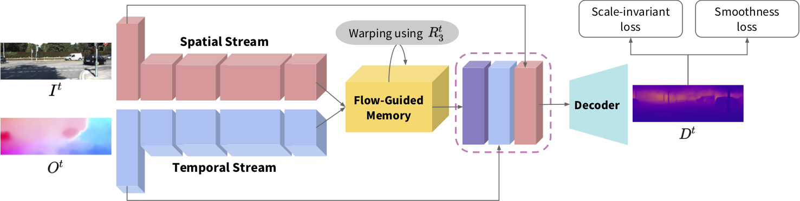

# FlowGRU



This repository contains a [TensorFlow](https://www.tensorflow.org/) implementation for our [flowGRU paper](). Our code is released only for scientific or personal use. Please contact us for commercial use.

## [ Requirements ]

TensorFlow 1.4.0

Cuda 8.0

Opencv 3.3.1

## [ Getting Started ]

### Datasets
- We conduct experiments on [KITTI](http://www.cvlibs.net/datasets/kitti/) and [Cityscapes](https://www.cityscapes-dataset.com/). Our method needs additional optical flow. In our framework, [DIS-flow](https://github.com/tikroeger/OF_DIS) is used. For convenience, we provide precomputed flow for the KITTI at [here](https://drive.google.com/open?id=1IiK7XwRdWQYJ5-IKik2L-7VQ0FEOYu9J).

### Training
- You can train our model using the below command on the specified GPUs by setting CUDA_VISIBLE_DEVICES. Before train the model, you should organize the path for RGB frames as *'/path_to_dataset/RGB'*, flow as *'/path_to_dataset/optflw_dis_inv'*, and ground-truth depth maps as *'/path_to_dataset/depth'*.
```
python main.py --data_path '/path_to_dataset'
```
- We also provide the link for our pre-trained weights [trained_on_KITTI](https://drive.google.com/file/d/1IYHORs4LI8o3h1XGGsLCBuf7X-Tr_52g/view?usp=sharing) and [trained_on_Cityscape_and_fine-tuned_on_KITTI](https://drive.google.com/open?id=1A2JcwoVg8D1tJTPmwz1Zb1vKrdVfI6hF). 

### Test
- Test the trained model with the below command.
```
python test.py --data_path '/path_to_dataset'
python test_scale.py --data_path '/path_to_dataset'
```

## [ Citation ]
Please cite our paper if you find the code useful for your research.
```
@inproceedings{
}
```

