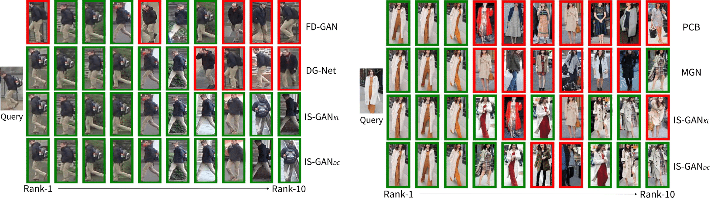

# ISGAN

This repository contains a [Pytorch](https://pytorch.org/) implementation for our [ISGAN (NeurIPS 2019)](https://cvlab-yonsei.github.io/projects/ISGAN/). Our code is released only for scientific or personal use. Please contact us for commercial use.

## Requirements

- Python 3.6
- Pytorch 1.0.0
- Cuda 10.0

<!--
## Results
<p align="center">

</p>
-->

## Getting Started

### Datasets
- We conduct experiments on [Market1501](http://www.liangzheng.com.cn/Project/project_reid.html), [CUHK03](http://www.ee.cuhk.edu.hk/~xgwang/CUHK_identification.html) and [DukeMTMC-reID](https://github.com/layumi/DukeMTMC-reID_baseline).
- The structure of data path should be organized as follows:
```
datasets/
    bounding_box_train/
    bounding_box_test/
    query/
```
- You can organize CUHK03 datasets as above using the command below. Download cuhk03_new_protocol_config_detected/labeled.mat [here](https://github.com/zhunzhong07/person-re-ranking/tree/master/evaluation/data/CUHK03).
```
python utils/transform_cuhk03.py --src <path/to/cuhk03_release> --dst <path/to/save>
```

### Train
- You can train your own model using the below commands. ISGAN is trained with 3 stages. Please refer the [paper]() for the details. Note that each dataset has the different number of identities and you have to change '*num_cls*' in *opt.py* (e.g. --num_cls 767 for CUHK03 and --num_cls 702 for DukeMTMC-reID datatsets)
```
python main.py --mode train --data_path <path/to/the/dataset> --stage 1
python main.py --mode train --data_path <path/to/the/dataset> --stage 2
python main.py --mode train --data_path <path/to/the/dataset> --stage 3
```

### Evaluate
- You can test the model using the below commands. Note that you also have to change '*num_cls*' option in *opt.py* according to the dataset.
- We provide our pre-trained weights on [Market1501](https://drive.google.com/file/d/1Ur2C-fk20OQ-1TMHWvuOR68yQ66k3b06/view?usp=sharing), [CUHK03_detected](https://drive.google.com/file/d/1XfBdoCz1tIxSsISF6IXKyCygNcGf02JV/view?usp=sharing), [CUHK03_labeled](https://drive.google.com/file/d/15mJzAm0XZu60NrW-ZvWDTu5KQB9vaN6l/view?usp=sharing), and [DukeMTMC-reID](https://drive.google.com/file/d/1Tdx3hsiiJHaoaggqSL7jCn-GqKSCORvB/view?usp=sharing).
```
python main.py --mode evaluate --data_path <path/to/the/dataset> --weight <path/to/the/weights>
```

## Citation
Please cite our paper if you find the code useful for your research.
```
@inproceedings{
}
```

## Acknowledgements
Our code is inspired by [ReID-MGN](https://github.com/GNAYUOHZ/ReID-MGN)
